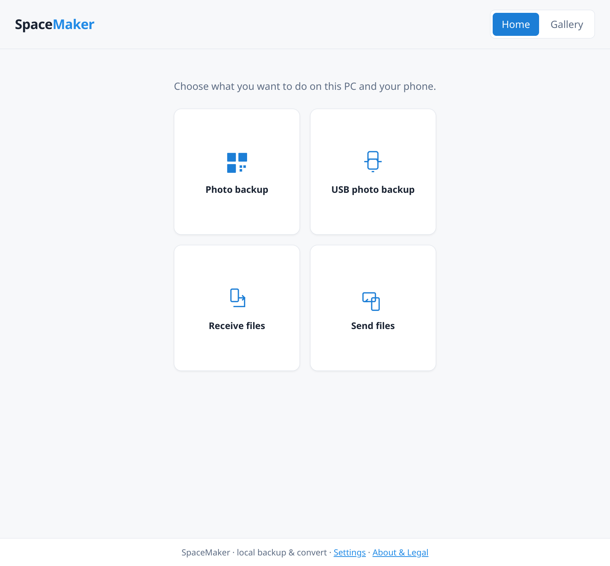

# SpaceMaker

**Local backup, convert, and gallery for phone media** — a desktop app that keeps your library on your PC and uses your Wi‑Fi network for phone uploads, downloads, and browsing.



SpaceMaker runs as a **local desktop application** (embedded web UI + FastAPI server). Your photos and videos stay under a library folder you choose; optional **LAN URLs and QR codes** let phones on the same network upload, download, or open the gallery without cloud services.

## Features

### Home hub

Four modules from one screen — only one Wi‑Fi session at a time:

- **Photo backup** — minimal flow: scan a QR code, files land in your library, convert runs as they arrive, open the gallery when ready.
- **USB photo backup** — full **Extract → Convert → Visualize** wizard with Wi‑Fi, MTP, or ADB (cable) and Copy/Move modes.
- **Receive files** — send arbitrary files from phone to PC into `~/Documents/SpaceMaker/`.
- **Send files** — pick files or folders on the desktop; phone downloads via QR.

### Backup & convert

- Pull media from **Wi‑Fi upload**, **MTP**, or **ADB** into `originals/`.
- Convert to **web-friendly outputs**: images toward **AVIF**, video via **hardware AV1 or H.264** when available (see [conversion policy](docs/playbooks/SpaceMaker-adaptations.md)).
- Library layout: `originals/`, `converted/`, `error/` (encode failed after retry), `invalid/` (unsupported or broken inputs).
- Review and recover problem files from the wizard or Easy-mode warnings.

### Gallery

- Browse **converted** media only — timeline or calendar, lazy thumbnails, item pages with metadata.
- **LAN URL + QR** so phones on the same network can open a mobile gallery shell.
- Export-friendly downloads (e.g. JPEG/MP4) on demand from item pages.

### Portable releases

- **Linux:** primary artifact is an **AppImage** (relocatable runtime + Qt WebEngine).
- **First run:** pinned third-party CLIs (FFmpeg, ImageMagick, adb, libmtp, exiftool, …) are **downloaded** into your user data folder — not bundled inside the binary. **Settings** shows status; **Continue** on the setup screen (or `SPACEMAKER_DEV=1` for contributors) allows system `PATH` fallbacks.
- **Windows / macOS:** optional PyInstaller onefile builds — see [packaging/README.md](packaging/README.md).

Details: [specs/packaging/SPEC.md](specs/packaging/SPEC.md), [tools/README.md](tools/README.md).

## Getting started

### Linux (AppImage)

1. Download the latest **`SpaceMaker-*-*.AppImage`** and **`SHA256SUMS`** from this repository’s **GitHub Releases** page (CI publishes on version tags `v*` — see [`.github/workflows/appimage.yml`](.github/workflows/appimage.yml)).
2. Verify the checksum, then `chmod +x SpaceMaker-*.AppImage` and run it.
3. Complete **Setting up components** on first launch (downloads into your data folder), or install tools yourself and choose **Continue**.
4. Pick a module on **Home** and follow on-screen QR / wizard steps.

Build your own AppImage: [packaging/README.md](packaging/README.md) (`uv run task build-appimage`).

### From source (quick try)

Requires [uv](https://docs.astral.sh/uv/) and Python ≥ 3.11:

```bash
uv run task sync-dev
uv run task spacemaker
```

Use `SPACEMAKER_DEV=1` if you rely on system-installed FFmpeg/adb/etc. instead of downloaded copies.

## Privacy & legal

SpaceMaker is **local-first**: media and library paths stay on your machine; LAN access is for devices on your network you choose to connect.

- [Privacy](docs/legal/PRIVACY.md)
- [Third-party tools](docs/legal/THIRD_PARTY_TOOLS.md)
- [Disclaimer](docs/legal/DISCLAIMER.md)

In-app: **About & Legal** in the footer.

## Development

### Prerequisites

- [uv](https://docs.astral.sh/uv/)
- Python ≥ 3.11 (managed by uv)
- Node.js + npm (Biome checks for wireframes and static UI)

### Setup and run

```bash
uv run task sync-dev          # install Python + dev dependencies
uv run task spacemaker        # desktop (pywebview + local server)
uv run task spacemaker-server # API/UI in browser only (no file picker)
```

Contributor tool resolution: set **`SPACEMAKER_DEV=1`**, or override the managed folder with **`SPACEMAKER_TOOLS_DIR`**. See [tools/README.md](tools/README.md).

On first launch the app downloads pinned CLIs into your user data folder unless dev/PATH rules apply. See [specs/packaging/SPEC.md](specs/packaging/SPEC.md).

### Quality gate

```bash
uv run task checks
uv run task checks -- --fix    # auto-fix where supported
npm ci && npm run check        # Biome (JS/HTML in wireframes + static UI)
```

### Release build (Linux)

```bash
uv run task build-appimage     # dist/SpaceMaker-<version>-<arch>.AppImage + SHA256SUMS
uv run task build-installer    # Linux AppDir only (no squashfs pack)
```

### README screenshot

After changing the Home hub UI, refresh the committed hero image:

```bash
uv run task readme-screenshot  # writes docs/assets/readme-home.png
```

Uses an isolated temp profile and offscreen Qt WebEngine (same 1200×900 viewport as the desktop window). If capture fails, try `QT_QPA_PLATFORM=xcb`.

### Project layout & conventions

- [docs/ARCHITECTURE.md](docs/ARCHITECTURE.md) — hexagonal layers and runtime flow
- [AGENTS.md](AGENTS.md) — spec-driven development, phase gates, agent workflow
- [specs/](specs/) — feature specifications and acceptance criteria
- `uv run task docs-serve` — browsable docs site (architecture, testing conventions) at `http://127.0.0.1:8000`
- `codenav` MCP server — type-resolved code navigation (symbol search, definition, references); see [AGENTS.md](AGENTS.md) "Orient before editing"

## License

MIT — see [pyproject.toml](pyproject.toml).
