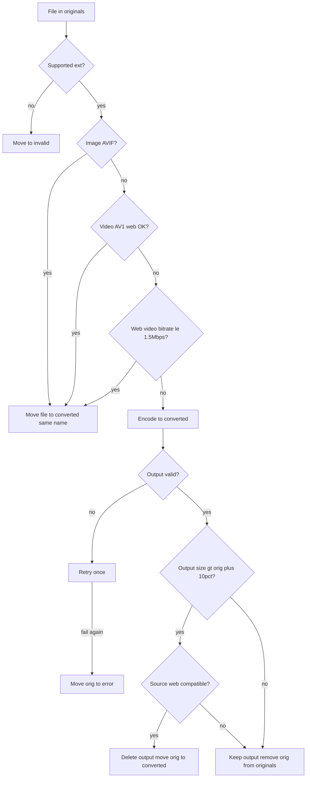

# Convert media (originals/ → converted/ | error/ | invalid/)

## Metadata

- **Feature:** Transcode or move-as-is all media from `originals/` per compression policy
- **Use case:** `ConvertMedia`
- **Ports:** `MediaConverter`, `FileSystem`, optional `MediaProbe` (ffprobe/magick identify abstracted)
- **Reference:** [docs/reference/convert_all_1_1.sh](../../docs/reference/convert_all_1_1.sh)
- **Packaging:** Adapters invoke **bundled** `ffmpeg`, `ffprobe`, `magick`, `exiftool` — [packaging/SPEC.md](../packaging/SPEC.md)
- **UI:** [main-wizard](../main-wizard/SPEC.md) Step 2

## Triggers & routing

- **Start (Advanced):** User clicks **Start convert** when enabled (see [main-wizard](../main-wizard/SPEC.md): enabled when `originals/` non-empty, including during extract; click **stops extract first** then converts).
- **Start (Easy):** [easy-mode](../easy-mode/SPEC.md) — after each Wi‑Fi upload into `originals/`, convert drains automatically **without** stopping extract; re-queues while files remain.
- **Input:** All files under `originals/` (recursive), processed in deterministic order (e.g. sorted relative path).
- **Output:** Each source file ends with no copy left in `originals/` except transient in-flight (success, move-as-is, `error/`, or `invalid/`).

## Supported extensions

From reference script (case-insensitive):

- **Images:** jpg, jpeg, png, webp, tiff, jxl, heic, heif, dng, avif, cr2, cr3, nef, nrw, arw, srf, sr2, raf, orf, rw2, pef, srw
- **Videos:** mp4, mov, mkv, webm, avi, m4v, mts, m2ts

Anything else (e.g. PDF) → `invalid/` without encode attempt.

## Web-compatible definitions

**Video container:** mp4, webm, mov.

**Video codec:** h264, hevc, vp9, av1.

**Audio codec (if stream present):** aac, mp3, opus, vorbis, flac.

**Image (size-rollback only):** jpg, jpeg, png, webp, gif, avif — not RAW/HEIC/TIFF/JXL.

## Routing decision (per file)

## Move-as-is (no re-encode)

Move from `originals/` to `converted/` with **same relative path and filename** when:

- Image extension is avif, or
- Video stream codec is av1 and file passes full video web-compatible check, or
- File passes video web-compatible check and bitrate ≤ 1_500_000 bps (use ffprobe `bit_rate`; fallback `(size_bytes * 8) / duration_seconds`).

## Image encode

- **Output path:** `{stem}.avif` beside source relative layout under `converted/` (see RAW+JPEG collision below).
- **Command policy (ImageMagick):** `-depth 10 -quality 80 -define avif:chroma-subsampling=444`
- **Metadata:** ExifTool `-TagsFromFile source -all:all` onto output (overwrite output tags).
- **Validation:** output size > 0 and `magick identify` succeeds.

### RAW + JPEG same stem (collision)

When `{stem}.avif` already exists and input is **jpeg/jpg**, output MUST be `{stem}_jpg.avif` or `{stem}_jpeg.avif` (lowercase ext token).

When input is RAW and `{stem}.avif` exists from a prior JPEG conversion, RAW still produces/replaces `{stem}.avif` per RAW rules (JPEG collision file is separate).

Both RAW and JPEG siblings must each produce a validated AVIF when both exist.

### RAW fallback

If ImageMagick cannot read RAW: extract `PreviewImage`, else `JpgFromRaw` via ExifTool to temp, encode temp. If no preview → move source to `invalid/`.

## Video encode

- **Output:** `{stem}.av1.mp4` under `converted/` (skip if input already ends with `.av1.mp4` case-insensitive — move-as-is path).
- **Hardware only:** no CPU encoders (no libsvtav1 / libx264) for library convert or friendly MP4 export.
- **Encoder priority:** av1_nvenc → av1_qsv → av1_vaapi (if render node present) → **h264_nvenc → h264_qsv → h264_vaapi** (if render node present). Never encode to HEVC/H.265 for library output (no in-browser preview).
- **No hardware encoder:** videos that would otherwise be re-encoded are **moved as-is** to `converted/` (same relative path). Gallery may omit inline preview for non-preview codecs (e.g. HEVC).
- **H.264 hardware fallback output:** `{stem}.h264.mp4` under `converted/` when AV1 hardware is unavailable but H.264 hardware is.
- **Audio:** libopus 256k; map metadata; movflags +faststart.
- **Validation:** size > 0 and ffprobe reports readable duration.

## Size rollback

If encoded output size > `source_size + source_size // 10`:

- If source is **web-compatible** (image or video per rules): delete output; **move** original to `converted/`.
- Else: keep output; remove original from `originals/`.

## Encode failure & retry

1. Delete partial output in `converted/` if present.
2. Leave source in `originals/`.
3. **Retry same file once** automatically.
4. If second attempt fails validation or encoder error: move source to `error/` (no partial in `converted/`).

## Invalid (no retry)

Move to `invalid/` when:

- Extension not in supported lists
- Image fails identify and is not RAW with preview path
- Video has no readable duration before encode
- RAW with no extractable preview

## Idempotency

If target output already exists in `converted/`, size > 0, and validates:

- Skip encode; remove source from `originals/` if still present (finish interrupted run).

If existing output invalid: delete and re-encode.

Files already in `error/` or `invalid/` are not reprocessed until user moves them back to `originals/` (out of scope: auto-requeue).

## User recovery (via UI)

- **Move error to converted:** move all files from `error/` → `converted/` unchanged (see main-wizard spec).

## Acceptance criteria (BDD)

### Scenario: AVIF image move-as-is

- **Given** an avif file in `originals/`
- **When** convert runs
- **Then** the file is moved to `converted/` with same name
- **And** `originals/` no longer contains it

### Scenario: Web-compatible low bitrate video move-as-is

- **Given** a web-compatible mp4 under 1.5 Mbps in `originals/`
- **When** convert runs
- **Then** the file is moved to `converted/` unchanged

### Scenario: Successful image encode removes source

- **Given** a png in `originals/`
- **When** convert encodes to valid avif
- **Then** `{stem}.avif` exists in `converted/`
- **And** the png is removed from `originals/`

### Scenario: DNG and JPEG both produce AVIF

- **Given** `photo.dng` and `photo.jpg` in the same folder under `originals/`
- **When** convert completes both
- **Then** `photo.avif` exists from RAW
- **And** `photo_jpg.avif` exists from JPEG
- **And** neither source remains in `originals/`

### Scenario: Size rollback keeps original bytes

- **Given** a web-compatible jpeg where avif encode would be larger than 110% of source
- **When** convert runs
- **Then** no oversized avif remains in `converted/`
- **And** the jpeg is moved to `converted/`

### Scenario: Non-web-compatible keeps larger encode

- **Given** a heic where avif is larger than 110% of source
- **When** convert runs
- **Then** the avif is kept in `converted/`
- **And** heic is removed from `originals/`

### Scenario: Encode fails twice then error folder

- **Given** a supported file whose encode fails validation twice
- **When** convert finishes that file
- **Then** the file is in `error/`
- **And** no invalid partial exists in `converted/`

### Scenario: PDF goes to invalid

- **Given** `doc.pdf` in `originals/`
- **When** convert runs
- **Then** `doc.pdf` is in `invalid/`
- **And** it is not in `originals/`

### Scenario: Skip valid existing output

- **Given** valid `{stem}.avif` already in `converted/` and source still in `originals/`
- **When** convert runs
- **Then** encode is skipped
- **And** source is removed from `originals/`

### Scenario: Progress events

- **Given** convert is running N files
- **When** each file reaches terminal state
- **Then** WebSocket progress updates completed count and percent

## Failure scenarios

| Case | Expected |
|------|----------|
| ffmpeg/magick missing | Fail fast at job start with clear error; no mass delete |
| Disk full during encode | Treat as encode failure → retry → error |
| exiftool tag copy fails | Log warning; still accept output if image validates (v1) |

## Validation rules (implementation)

| Check | Images | Videos |
|-------|--------|--------|
| Exists | yes | yes |
| Size > 0 | yes | yes |
| Readable | magick identify | ffprobe duration |

Never delete `originals/` source until validation passes (except move-as-is paths that move atomically after checks).

## Testing strategy

| Layer | Coverage |
|-------|----------|
| Unit | Routing table: extension, web-compat, bitrate, collision names, rollback math |
| Unit | Retry policy: first fail stays in originals; second fail → error |
| Unit | Fake `MediaConverter` returns oversize / invalid / valid |
| Integration | Adapter builds ffmpeg args matching reference script for one nvenc and one svt path (snapshot or parsed argv) |
| Integration | Filesystem moves preserve relative paths across folders |
| Mark `@pytest.mark.integration` | Optional real ffmpeg in developer-only runs |

## Out of scope

- User-adjustable CRF/quality in UI
- Parallel encode worker pool sizing (implementation detail; must be safe)
- Re-converting files already in `converted/` without putting sources back in `originals/`
