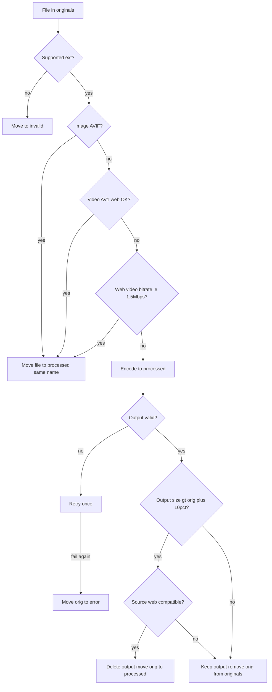

# Convert media (originals/ → processed/ | error/ | invalid/)

## Metadata

- **Feature:** Transcode or move-as-is all media from `originals/` per compression policy
- **Use case:** `ConvertMedia`
- **Ports:** `MediaConverter`, `FileSystem`, optional `MediaProbe` (ffprobe/magick identify abstracted)
- **Reference:** [docs/reference/convert_all_1_1.sh](../../docs/reference/convert_all_1_1.sh)
- **Packaging:** Adapters invoke **bundled** `ffmpeg`, `ffprobe`, `magick`, `avifenc`, `exiftool` — [packaging/SPEC.md](../packaging/SPEC.md)
- **UI:** [main-wizard](../main-wizard/SPEC.md) Step 2

## Design decisions

Added retroactively during the 2026-10 pre-1.0 review (this spec predates the section).

- **Success criteria:** every file in `originals/` ends in exactly one of `processed/` (encoded or moved as-is), `error/` or `invalid/`; an original is deleted only after its output exists and validates (or after being filed as-is). Re-running convert on the same library never loses a file and never leaves two copies of the same encode.
- **Failure handling:** encode failures retry once, then the source moves to `error/`; unreadable inputs go to `invalid/`. Output is written to a staging dir and renamed, so a crash leaves no partial file in `processed/`. A name clash never overwrites: byte-identical files collapse to one, otherwise the newcomer gets a unique name.
- **Performance / resource budget:** one file encoded at a time per convert job; staging and duplicate checks stream in 1 MiB chunks (no whole-file reads); the duplicate check compares only against the plain-named output.
- **Trust boundary:** inputs are untrusted file names and bytes from phones; relative paths are validated (no `..`, no absolute or drive-qualified paths) before any filesystem access.

## Triggers & routing

- **Start (Advanced):** User clicks **Start convert** when enabled (see [main-wizard](../main-wizard/SPEC.md): enabled when `originals/` non-empty, including during extract; click **stops extract first** then converts).
- **Start (Easy):** [easy-mode](../easy-mode/SPEC.md) — after each Wi‑Fi **file** lands in `originals/` (saved or size-skipped; not after the whole multipart request), when **Compress media** is on and tools are available, convert drains automatically **without** stopping extract; re-queues while files remain. While convert is running, progress `total` is live: `completed + count(originals/)`. When Compress media is off, Easy does not start convert; instead it **promotes** uploads as-is from `originals/` → `processed/` (see easy-mode).
- **Input:** All files under `originals/` (recursive), processed in deterministic order (e.g. sorted relative path).
- **Output:** Each source file ends with no copy left in `originals/` except transient in-flight (success, move-as-is, `error/`, or `invalid/`).

## Supported extensions

From reference script (case-insensitive):

- **Images:** jpg, jpeg, png, webp, tiff, jxl, heic, heif, dng, avif, cr2, cr3, nef, nrw, arw, srf, sr2, raf, orf, rw2, pef, srw
- **Videos:** mp4, mov, mkv, webm, avi, m4v, mts, m2ts

Anything else (e.g. PDF) → `invalid/` without encode attempt.

## Web-compatible definitions

**Video container:** mp4, webm, mov.

**Video codec:** h264, hevc, vp9, av1.

**Audio codec (if stream present):** aac, mp3, opus, vorbis, flac.

**Image (size-rollback only):** jpg, jpeg, png, webp, gif, avif — not RAW/HEIC/TIFF/JXL.

## Routing decision (per file)

```mermaid
flowchart TD
  start[File in originals]
  ext{Supported ext?}
  inv[Move to invalid]
  avif{Image AVIF?}
  av1v{Video AV1 web OK?}
  low{Web video bitrate le 1.5Mbps?}
  move[Move file to processed same name]
  enc[Encode to processed]
  ok{Output valid?}
  sz{Output size gt orig plus 10pct?}
  web{Source web compatible?}
  drop[Delete output move orig to processed]
  keep[Keep output remove orig from originals]
  retry[Retry once]
  err[Move orig to error]
  start --> ext
  ext -->|no| inv
  ext -->|yes| avif
  avif -->|yes| move
  avif -->|no| av1v
  av1v -->|yes| move
  av1v -->|no| low
  low -->|yes| move
  low -->|no| enc
  enc --> ok
  ok -->|no| retry
  retry -->|fail again| err
  ok -->|yes| sz
  sz -->|yes| web
  web -->|yes| drop
  web -->|no| keep
  sz -->|no| keep
```

## Move-as-is (no re-encode)

Move from `originals/` to `processed/` with **same relative path and filename** when:

- Image extension is avif, or
- Video stream codec is av1 and file passes full video web-compatible check, or
- File passes video web-compatible check and bitrate ≤ 1_500_000 bps (use ffprobe `bit_rate`; fallback `(size_bytes * 8) / duration_seconds`).

## Image encode

- **Output path:** `{stem}.avif` beside source relative layout under `processed/` (see RAW+JPEG collision below).
- **Progressive AVIF (preferred when `avifenc` is resolvable):** encode a **layered progressive** AVIF so compatible browsers can paint a base layer while higher layers stream in (plain `` / gallery `/media/` — no special viewer). Flags: `avifenc --progressive -d 10 -q 80 -y 444 --ignore-xmp`. XMP from the input is dropped at this step because the subsequent ExifTool pass copies metadata from the original anyway, and some RAW embedded previews carry duplicate XMP segments that `avifenc` refuses to decode (see RAW fallback). Then ExifTool `-TagsFromFile source -all:all` onto output; strip Orientation when pixels are already oriented.
- **Input routing when `avifenc` is available** (prefer fewer steps — no Magick pre-pass when unnecessary):
	1. **JPEG / PNG** — call `avifenc` on the source directly (`avifenc` applies JPEG EXIF orientation).
	2. **RAW** — ExifTool extract `PreviewImage` / `JpgFromRaw` to a temp JPEG, then `avifenc` on that temp (no Magick). If no preview → `invalid/`.
	3. **Other supported images** (HEIC, TIFF, JXL, WebP, etc.) — Magick rasterizes to a temp PNG (`-auto-orient`), then `avifenc` on the temp.
- **Fallback (`avifenc` missing):** ImageMagick single-layer AVIF — `-auto-orient -depth 10 -quality 80 -define avif:chroma-subsampling=444` — same ExifTool metadata step. Convert still succeeds; progressive paint is unavailable for that encode. RAW still uses ExifTool preview then Magick encode when Magick cannot read RAW directly.
- **Already AVIF:** move-as-is (no re-encode) — existing files are **not** rewritten as progressive. Progressive applies only to newly encoded images.
- **Metadata:** ExifTool `-TagsFromFile source -all:all` onto output (overwrite output tags). ExifTool tag-copy failure: log warning; still accept output if image validates (v1).
- **Validation:** output size > 0 and `magick identify` succeeds.
- **Magick remains required** for gallery thumbs, friendly JPEG export, identify, and rasterizing formats `avifenc` cannot read — progressive encode does **not** remove ImageMagick as a project dependency.

### Same-stem collision (any extensions)

When `{stem}.avif` (or `{stem}.av1.mp4` / `{stem}.h264.mp4` for video) already exists in `processed/` and a *different* source with the same stem is converted, output MUST be `{stem}_{ext}.avif` (resp. `{stem}_{ext}.av1.mp4` / `{stem}_{ext}.h264.mp4`) with the lowercase source extension token (`jpg`, `png`, `heic`, `dng`, `mov`, …). This applies to RAW too: a RAW source never replaces another source's output.

Both RAW and JPEG siblings must each produce a validated AVIF when both exist.

### RAW fallback

When `avifenc` is available: extract `PreviewImage`, else `JpgFromRaw` via ExifTool to temp JPEG, then `avifenc` on the temp. If no preview → move source to `invalid/`.

When `avifenc` is missing: if ImageMagick cannot read RAW, same ExifTool preview extract then Magick AVIF encode. If no preview → `invalid/`.

## Staging (atomic output)

Encoded output is written to a **staging file** under `{library_root}/.convert-staging/` (same relative path as the eventual `processed/` output; same volume as `processed/` so the final move is a rename, not a copy), **never directly into `processed/`**. ExifTool metadata copy, output validation, and the size-rollback check (below) all run against the staging file. Only once the staging file is a validated, fully-written output does it get **moved** into `processed/` at its final path — replacing any existing file there — followed by deleting the source from `originals/`. This means `processed/` never contains a partial or in-progress output that a concurrent gallery index sync or thumbnail request could observe mid-write. `.convert-staging/` is excluded from convert/extract scans (like `.thumbnails/` and `.exports/`) and is cleared of stale files when a convert run starts (e.g. left over from a prior crash).

## Video encode

- **Output:** `{stem}.av1.mp4` under `processed/` (skip if input already ends with `.av1.mp4` case-insensitive — move-as-is path).
- **Hardware only:** no CPU encoders (no libsvtav1 / libx264) for library convert or friendly MP4 export.
- **Encoder priority:** av1_nvenc → av1_qsv → av1_vaapi (if render node present) → **h264_nvenc → h264_qsv → h264_vaapi** (if render node present). Never encode to HEVC/H.265 for library output (no in-browser preview).
- **No hardware encoder:** videos that would otherwise be re-encoded are **moved as-is** to `processed/` (same relative path). Gallery may omit inline preview for non-preview codecs (e.g. HEVC).
- **H.264 hardware fallback output:** `{stem}.h264.mp4` under `processed/` when AV1 hardware is unavailable but H.264 hardware is.
- **Audio:** libopus 256k; map metadata; movflags +faststart.
- **Validation:** size > 0 and ffprobe reports readable duration.

## Size rollback

If encoded output size > `source_size + source_size // 10`:

- If source is **web-compatible** (image or video per rules): delete output; **move** original to `processed/`.
- Else: keep output; remove original from `originals/`.

## Encode failure & retry

1. Delete partial output in `processed/` if present.
2. Leave source in `originals/`.
3. **Retry same file once** automatically.
4. If second attempt fails validation or encoder error: move source to `error/` (no partial in `processed/`).

## Invalid (no retry)

Move to `invalid/` when:

- Extension not in supported lists
- Image fails identify and is not RAW with preview path
- Video has no readable duration before encode
- RAW with no extractable preview

## Idempotency

If the *planned* output (after collision naming above) already exists in `processed/`, size > 0, and validates:

- Skip encode; remove source from `originals/` if still present (finish interrupted run).

If existing output invalid: delete and re-encode.

**Duplicate collapse:** encoding is deterministic for the same source and settings, so when a collision-named output (`{stem}_{ext}.*`) turns out byte-identical to the plain-named output (e.g. a run interrupted after the encode, before the source was removed), the new output is discarded and the source removed. Outputs from a different encoder version may differ and then remain as two files (harmless).

Moving a source as-is into `processed/`, `error/` or `invalid/` MUST never overwrite a different file: a byte-identical file with the same name counts as the same file (source dropped); otherwise the source is stored as `{name} (2).{ext}`, `(3)`, ….

Files already in `error/` or `invalid/` are not reprocessed until user moves them back to `originals/` (out of scope: auto-requeue).

## User recovery (via UI)

- **Move error to processed:** move all files from `error/` → `processed/` unchanged (see main-wizard spec).

## Acceptance criteria (BDD)

### Scenario: AVIF image move-as-is

- **Given** an avif file in `originals/`
- **When** convert runs
- **Then** the file is moved to `processed/` with same name
- **And** `originals/` no longer contains it

### Scenario: Web-compatible low bitrate video move-as-is

- **Given** a web-compatible mp4 under 1.5 Mbps in `originals/`
- **When** convert runs
- **Then** the file is moved to `processed/` unchanged

### Scenario: Successful image encode removes source

- **Given** a png in `originals/`
- **When** convert encodes to valid avif
- **Then** `{stem}.avif` exists in `processed/`
- **And** the png is removed from `originals/`

### Scenario: Image encode prefers progressive avifenc

- **Given** `avifenc` and `magick` are resolvable
- **And** a JPEG or PNG in `originals/`
- **When** convert encodes the image
- **Then** the output is produced by calling `avifenc --progressive` on the source (no Magick rasterize step)
- **And** ExifTool copies metadata onto the output
- **And** `{stem}.avif` exists in `processed/`

### Scenario: Image encode uses Magick only to rasterize formats avifenc cannot read

- **Given** `avifenc` and `magick` are resolvable
- **And** a HEIC (or other non-JPEG/PNG image `avifenc` cannot read) in `originals/`
- **When** convert encodes the image
- **Then** Magick rasterizes to a temp PNG, then `avifenc --progressive` encodes that temp
- **And** `{stem}.avif` exists in `processed/`

### Scenario: Image encode falls back to magick when avifenc missing

- **Given** `magick` is resolvable and `avifenc` is not
- **And** a non-AVIF image in `originals/`
- **When** convert encodes the image
- **Then** a valid AVIF is still produced via ImageMagick
- **And** `{stem}.avif` exists in `processed/`

### Scenario: DNG and JPEG both produce AVIF

- **Given** `photo.dng` and `photo.jpg` in the same folder under `originals/`
- **When** convert completes both
- **Then** `photo.avif` exists from RAW
- **And** `photo_jpg.avif` exists from JPEG
- **And** neither source remains in `originals/`

### Scenario: Size rollback keeps original bytes

- **Given** a web-compatible jpeg where avif encode would be larger than 110% of source
- **When** convert runs
- **Then** no oversized avif remains in `processed/`
- **And** the jpeg is moved to `processed/`

### Scenario: Non-web-compatible keeps larger encode

- **Given** a heic where avif is larger than 110% of source
- **When** convert runs
- **Then** the avif is kept in `processed/`
- **And** heic is removed from `originals/`

### Scenario: Encode fails twice then error folder

- **Given** a supported file whose encode fails validation twice
- **When** convert finishes that file
- **Then** the file is in `error/`
- **And** no invalid partial exists in `processed/`

### Scenario: PDF goes to invalid

- **Given** `doc.pdf` in `originals/`
- **When** convert runs
- **Then** `doc.pdf` is in `invalid/`
- **And** it is not in `originals/`

### Scenario: Same-stem sources get distinct outputs

- **Given** `photo.jpg` already converted to `processed/photo.avif`
- **And** `photo.png` in `originals/`
- **When** convert runs
- **Then** the PNG is encoded to `processed/photo_png.avif`
- **And** `processed/photo.avif` is untouched

### Scenario: Duplicate output collapses

- **Given** an interrupted run left `processed/photo_png.avif` byte-identical to `processed/photo.avif`, source still in `originals/`
- **When** convert runs and the new encode matches `photo.avif`
- **Then** the new output is discarded
- **And** the source is removed from `originals/`

### Scenario: Move never overwrites a different file

- **Given** `processed/web.avif` exists with different content than `originals/web.avif`
- **When** convert moves the source as-is
- **Then** it is stored as `processed/web (2).avif`
- **And** the existing file is untouched

### Scenario: Skip valid existing output

- **Given** the source's own planned output (`{stem}.avif`, or `{stem}_{ext}.avif` when the plain name belongs to another source) already valid in `processed/` and source still in `originals/`
- **When** convert runs
- **Then** encode is skipped
- **And** source is removed from `originals/`

### Scenario: RAW preview with duplicate XMP still converts

- **Given** a RAW file (e.g. iPhone ProRAW `.dng`) whose embedded `PreviewImage` JPEG contains multiple standard XMP segments
- **When** convert encodes the image via `avifenc`
- **Then** encode succeeds (XMP from the preview is ignored per the progressive AVIF flags)
- **And** `{stem}.avif` exists in `processed/` with metadata copied from the original RAW

### Scenario: In-progress encode is never visible in processed/

- **Given** convert is encoding a file
- **When** a gallery index sync or thumbnail request reads `processed/` concurrently
- **Then** it sees either no file at that output path, or the complete, previously-valid file — never a partial or currently-being-rewritten one
- **And** the in-progress output lives under `.convert-staging/` until it is validated and atomically moved into `processed/`

### Scenario: Progress events

- **Given** convert is running N files
- **When** each file reaches terminal state
- **Then** WebSocket progress updates completed count and percent

### Scenario: Easy live progress total while receiving

- **Given** Easy concurrent convert is running with progress reflecting files known so far
- **When** additional files land in `originals/` before the current pass finishes
- **Then** WebSocket progress `total` grows to `completed + count(originals/)` without a second convert job
- **And** Advanced Step 2 convert (stop-extract-first) is unchanged

## Failure scenarios

| Case | Expected |
|------|----------|
| ffmpeg/magick missing | Fail fast at job start with clear error; no mass delete |
| avifenc missing | Image encode uses ImageMagick fallback; convert does not fail solely for missing avifenc |
| Disk full during encode | Treat as encode failure → retry → error |
| exiftool tag copy fails | Log warning; still accept output if image validates (v1) |

## Validation rules (implementation)

| Check | Images | Videos |
|-------|--------|--------|
| Exists | yes | yes |
| Size > 0 | yes | yes |
| Readable | magick identify | ffprobe duration |

Never delete `originals/` source until validation passes (except move-as-is paths that move atomically after checks).

## Testing strategy

| Layer | Coverage |
|-------|----------|
| Unit | Routing table: extension, web-compat, bitrate, collision names, rollback math |
| Unit | Retry policy: first fail stays in originals; second fail → error |
| Unit | Fake `MediaConverter` returns oversize / invalid / valid |
| Integration | Adapter builds ffmpeg args matching reference script for one nvenc and one svt path (snapshot or parsed argv) |
| Integration | Filesystem moves preserve relative paths across folders |
| Mark `@pytest.mark.integration` | Optional real ffmpeg in developer-only runs |

## Out of scope

- User-adjustable CRF/quality in UI
- Parallel encode worker pool sizing (implementation detail; must be safe)
- Re-converting files already in `processed/` without putting sources back in `originals/`
- Re-encoding existing AVIF in `processed/` solely to add progressive layers
